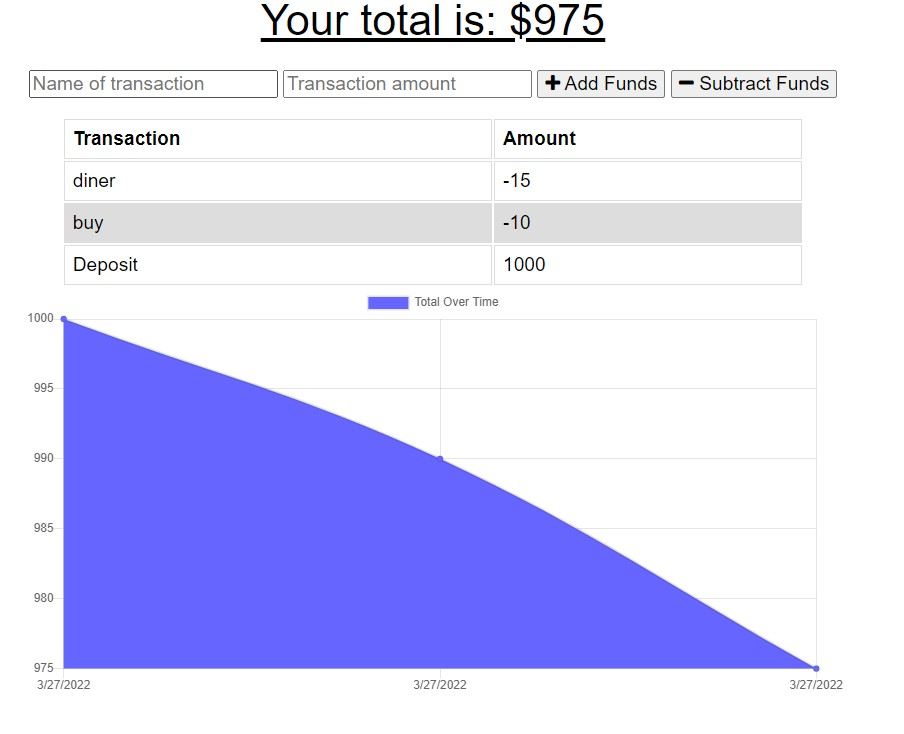

# money-tracker

## Purpose
[Money tracker](https://bens-money-tracker.herokuapp.com/) is an application that allows to keep track of your money while you are traveling, .

Here is the link to the deployed app: https://bens-money-tracker.herokuapp.com/
## Built with
* Javascript
* NPM Packages 
  * express
  * mongoose

## You can have Money tracker in your cel or computer

Follow this instrucctions
* On your computer, open Chrome.

* Go to [Money tracker](https://bens-money-tracker.herokuapp.com/)

* At the top right of the address bar, click Install ➕.

* Follow the onscreen instructions to install the PWA.

## GitHub Repository

https://github.com/Benitocr/money-tracker

## Contribution
2022  by [Benito Cavazos](https://github.com/Benitocr)